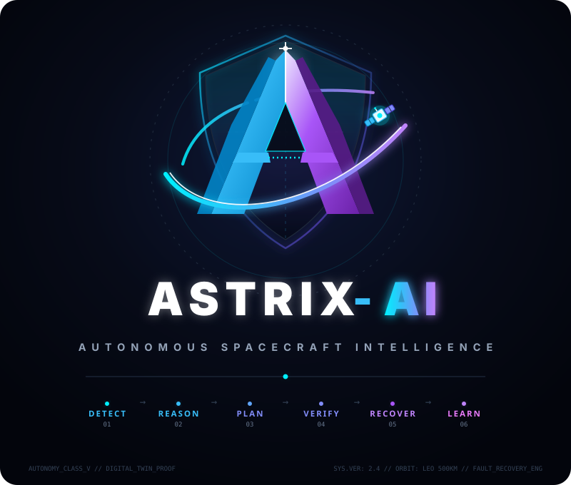

<div align="center">



### AUTONOMOUS SPACECRAFT INTELLIGENCE &amp; EXECUTION
**Detect &bull; Reason &bull; Plan &bull; Verify &bull; Recover &bull; Learn**

</div>

---

Astrix-AI flies a simulated Earth-observation satellite from the launch pad to orbit,
watches its telemetry, and when something goes wrong it detects the fault,
diagnoses it, plans a recovery, proves the plan against safety rules and a digital
twin, executes it (or asks a human first), measures what actually happened, and
writes the lesson to mission memory.

Everything runs locally. Multi-model gateway supports Anthropic, Google Gemini (free tier),
Groq (free tier), OpenAI, and local offline models via Ollama. No API key is strictly required:
without one, every agent falls back to its deterministic reasoner seamlessly. The
detection, safety, simulation, ontological knowledge graph and memory layers are identical either way.

> **Results are hypothetical.** Astrix-AI runs on simulated spacecraft, first-order
> launch, intercept and vehicle models, and advisory AI reasoning. Every result must be
> verified against real-time prototypes, hardware-in-the-loop tests and uploaded flight
> or test data before it informs any engineering or operational decision. The console
> shows this notice on every page and the API returns it in an `X-Astrix-Notice` header.

---

## What's in the workspace

| Area | What it does |
|---|---|
| **Landing page** (`/`) | Public overview. Lightweight, and loads no console code. |
| **Astrix** (`/app#/assistant`) | Chat-style home. Say *launch mission*, *inject wheel degradation*, *approve*, *design a 3-stage rocket for a 400 kg satellite to 700 km*, *run an intercept check with seeker dropout*, *train model*, *use groq*. Commands run through the same verified services as the buttons. Free-form questions go to the active reasoner. |
| **Flight Assurance** | Spacecraft anomaly testing before and after launch: fly the ascent (reference or custom vehicle, nominal or with a launch fault), then inject on-orbit faults and watch the detect → recover → learn loop. |
| **Intercept Lab** | Missile trajectory testing: pre-flight GO/NO-GO, predicted intercept point and miss distance, then vehicle faults or cyber attacks during the engagement. |
| **Vehicle Studio** | Design rockets (1–4 stages) and satellites by hand, from presets or from a plain-English prompt. It reports Δv, T/W, loss budget, orbit margin and power budget, previews the ascent, and flies the design in the 2D launch panel. Undersized vehicles abort; they never get an orbit they did not earn. |
| **Astrix-LM** | Captures verified decisions in an encrypted, hash-chained corpus, trains Astrix's own nano model (shadow-scored against live decisions), and exports JSONL to LoRA fine-tune a small open LLM that runs through Ollama (`scripts/train_astrix_lm.py`). |
| **Mission Memory** | Knowledge profile, lessons, anomaly history and audit trail. |

## Reasoners (free LLM providers)

Every agent works without an LLM. Add any key below to the backend environment and pick
the provider from the reasoner menu in the console's top bar, or set `ASTRIX_LLM_PROVIDER`.
The gateway tries the active provider first, falls back through every other configured one,
pauses a provider for 60 s after repeated failures, and finally uses the deterministic reasoners.

| Provider | Env var | Free tier (Sept 2026, check before relying on it) | Default model |
|---|---|---|---|
| Google Gemini | `GEMINI_API_KEY` | Free Flash tier, no card | `gemini-flash-latest` |
| Groq | `GROQ_API_KEY` | ~30 req/min, ~1k req/day | `openai/gpt-oss-120b` |
| Hugging Face | `HF_TOKEN` | Small monthly credit | `Qwen/Qwen3-32B` |
| Local Ollama | none | Unlimited, offline | `qwen3:8b` (also `llama3.2:3b`, `gemma3:4b`, `phi4-mini`, `astrix-lm`, …) |

Override any default model with `ASTRIX_<PROVIDER>_MODEL`, e.g. `ASTRIX_GROQ_MODEL=qwen/qwen3-32b`.
Keys stay on the server and are never sent to the browser.

## Deploy: console on Vercel, API in a container

The console is static and deploys to Vercel. The backend holds a long-running simulator
and WebSockets, which Vercel functions cannot host, so it runs as a container
(Render, Fly.io, Railway, Cloud Run or a VM).

**Backend**

```bash
docker build -t astrix-api .
docker run -p 8000:8000 \
  -e ASTRIX_API_TOKEN=<long random string> \
  -e ASTRIX_CORPUS_KEY=<Fernet key> \
  -e ASTRIX_CORS_ORIGIN_REGEX='https://.*\.vercel\.app' \
  -e GROQ_API_KEY=... -v astrix-data:/app/data astrix-api
```

Generate the Fernet key with
`python -c "from cryptography.fernet import Fernet; print(Fernet.generate_key().decode())"`.
On Render, `render.yaml` is a ready Blueprint. The image trains the anomaly detector at
build time, so containers cold-start in seconds.

**Console**

1. Import the repo in Vercel and set **Root Directory** to `frontend`. `frontend/vercel.json`
   configures the build, the `/app` rewrite, immutable asset caching and security headers.
2. Set `VITE_API_BASE=https://your-api.example.com` (build-time), or leave it empty and enter
   the backend URL under **Profile and settings → Connection**. Operators sign in with an
   account; there is no API key to paste.

Performance: the landing page ships ~14 kB gzipped of JS. The console, each lab and the chart
library are separate lazily loaded chunks, and the API gzips responses over 1 kB.

Security: set `ASTRIX_API_TOKEN` on any public backend. Every POST/PUT/PATCH/DELETE then needs
`Authorization: Bearer <token>`. Set `ASTRIX_CORPUS_KEY` from a secret manager.

---

## Quick start

```bash
python -m venv .venv
.venv/Scripts/activate            # Windows;  source .venv/bin/activate on macOS/Linux
pip install -r requirements.txt

# terminal 1 — backend (run from the repository root)
uvicorn backend.app.main:app --reload --port 8000

# terminal 2 — dashboard
cd frontend && npm install && npm run dev      # http://localhost:5173
```

The first backend start trains the anomaly detector on two simulated orbits of
fault-free telemetry (about a minute) and seeds mission memory. Both are cached.

## Running the demo

1. **Launch.** Press **Launch mission**. The 2D view flies the ascent: countdown,
   liftoff, max-Q, staging, fairing jettison, orbit insertion at 500 km, payload
   separation and array deployment, with the milestone checklist filling in beside
   it. Pick 10×/20×/60× for how fast the ascent replays.
2. **Nominal orbit.** At deployment the view switches to the orbit scene and ASTRIX
   begins monitoring. Let it run: eclipse, imaging passes and ground contacts all
   come and go without an alarm. That silence is a result, not dead air — see
   *Detection quality* below.
3. **Inject a fault.** Choose a scenario and press **Inject** (only enabled in
   orbit — before deployment there is no satellite to inject into). Watch the
   fault timeline record how many spacecraft-seconds ASTRIX took to detect,
   alarm, diagnose, decide and act.
4. **Approve a recovery.** Anything above the autonomy limit waits for a human.
   Approving re-verifies the action against current telemetry before it is sent.
5. **Try the benign case.** `benign_thermal_transient` is *not* a fault. ASTRIX
   should notice the excursion and suppress it. Showing this is what separates a
   detector from an alarm generator.

Prefer to skip the ascent? Untick **fly launch** to start in orbit.

## What is real and what is simulated

| Layer | Status |
|---|---|
| Spacecraft dynamics, faults, launch profile | Simulated (`telemetry/`) — physics-lite and deterministic |
| Anomaly detection, context scoring, diagnosis, planning, safety rules, digital twin, mission memory | Real implementations operating on that telemetry |
| LLM reasoning | Optional. Without credentials every agent uses its deterministic reasoner |

ASTRIX never reaches into the spacecraft: approved actions are queued and the
vehicle collects them, which is why the simulator applies them on its next step.

**The launch is not monitored by the anomaly detector.** The detector is trained on
on-orbit telemetry; ascent is checked against fixed range-safety limits instead.
Monitoring engages once the satellite is deployed and settled.

## Detection quality

`scripts/evaluate_detection.py` is the honest scoreboard: it soaks ASTRIX in
fault-free flight and then measures time-to-detect for every scenario.

```bash
python scripts/evaluate_detection.py --orbits 4
```

It exits non-zero if nominal flight raises any alarm or a real fault is missed.

The detector is a hybrid, because neither half is sufficient alone:

* an **Isolation Forest** catches unusual *combinations* of channels, but saturates
  on single-channel excursions (a CPU pinned at 100% scored ~0.05);
* a **mode-conditioned extreme-value score** catches those excursions, judging each
  channel against what is normal *for the current operating mode* (imaging, eclipse,
  ground contact, slew), with per-channel thresholds calibrated on held-out orbits.

The context scorer then weighs the ML score against the mode envelope, cross-sensor
corroboration, history, persistence and mission impact, and can suppress an
uncorroborated deviation outright.

## Tests

```bash
python -m pytest tests -q                 # launch, vehicles, loop, runner, hardware, corpus, assistant, API
python scripts/run_scenario.py --no-llm   # one full loop, headless, end to end
node frontend/scripts/ui_smoke.mjs                 # dashboard in a real browser (needs both servers)
```

## Layout

```
backend/app/
  agents/      diagnostic, risk, recovery, learning, resource + the LLM bridge
  ml/          feature engineering, hybrid detector, context-aware scoring
  safety/      deterministic rule engine and limits.yaml
  simulation/  digital twin used to test plans before execution
  memory/      structured (SQL) and vector mission memory
  services/    the loop (pipeline), mission runner, telemetry buffer, event bus
  training/    encrypted hash-chained corpus and the Astrix-LM nano model
  api/         REST + WebSocket surface, assistant, vehicles, model
telemetry/     spacecraft simulator, fault scenarios, launch profile, vehicle designs
frontend/      landing page + React console (assistant, labs, 2D views, charts)
training/      Ollama Modelfile for a fine-tuned Astrix-LM
scripts/       scenario runner, detection evaluation, LoRA fine-tuning
```

## Configuration

Copy `.env.example` to `.env`. Everything a judge might ask you to change live —
severity thresholds, scoring weights, the autonomy limit, the model id — is in
`backend/app/config.py` or `backend/app/safety/limits.yaml`, never hard-coded in a
decision path. `POST /safety/reload` re-reads the limits without a restart.

API documentation is at http://localhost:8000/docs while the backend is running.
